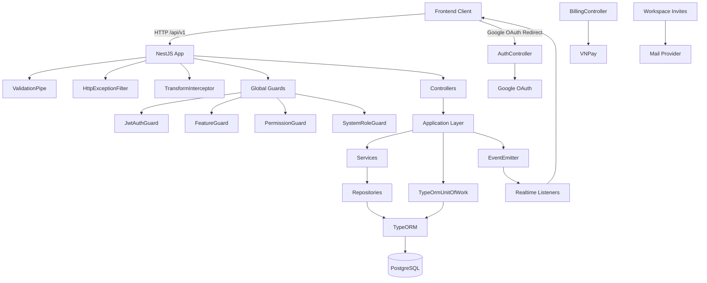
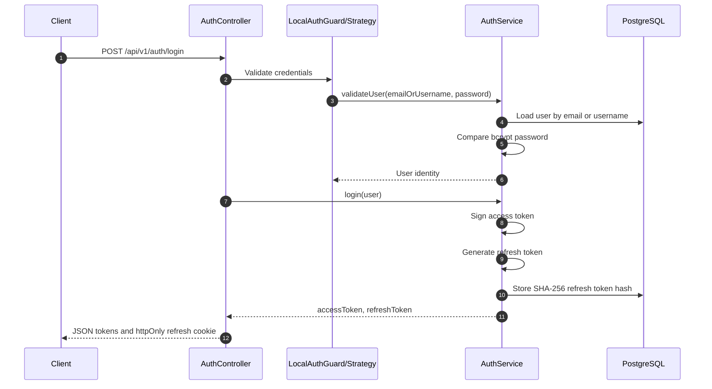
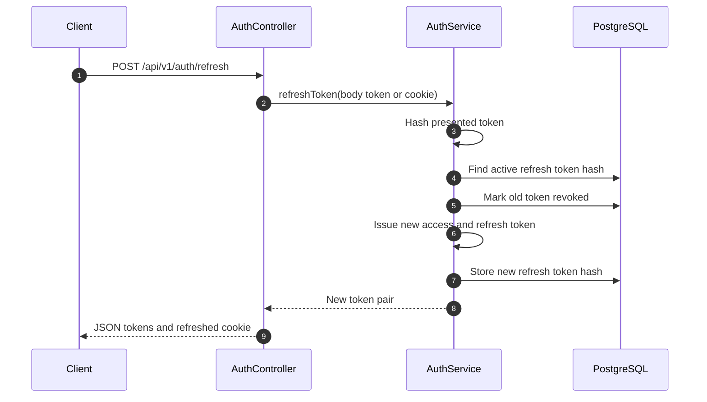
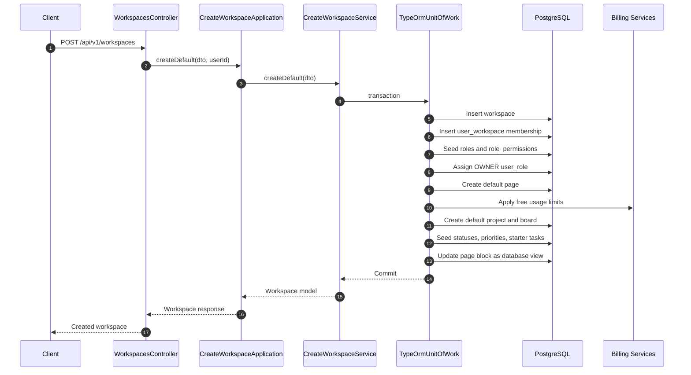
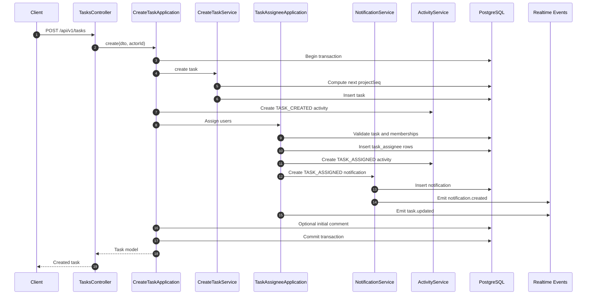
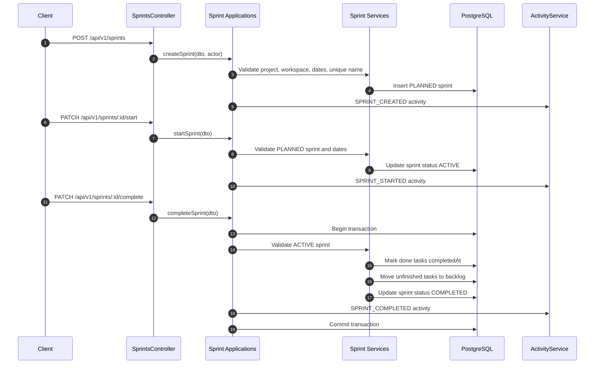
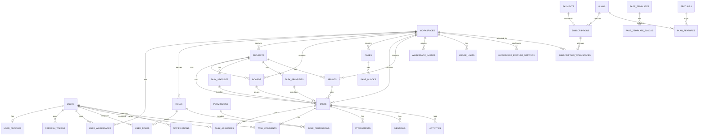
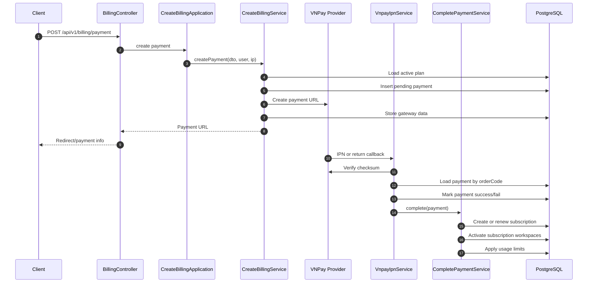

# Codebase Onboarding and Architecture Review

This document summarizes the backend architecture, module flows, database model, API surface, execution pipeline, dependencies, and architectural risks for the task-management backend.

Scope:

- Repository: `back-task`
- Runtime: NestJS backend
- Database: PostgreSQL through TypeORM
- Frontend: not present in this repository. The backend is configured to accept a frontend origin through `CLIENT_URL`, defaulting to `http://localhost:3000`.
- Source code was reviewed read-only. No build or test commands were run because they may generate artifacts such as `dist`, coverage, or caches.

## 1. High-Level Architecture

### Overall System Architecture

The project is a modular NestJS backend for a collaborative task-management product. It supports users, authentication, workspaces, RBAC permissions, projects, boards, pages, tasks, sprints, notifications, activity logs, attachments, feature gating, and billing.

The dominant internal pattern is:

```text
Controller -> Application -> Service -> Repository -> Mapper -> TypeORM Entity -> PostgreSQL
```

Not every module uses every layer. Some simple modules are mostly scaffolding, while core workflows such as workspace creation, project creation, task assignment, sprint completion, and billing use application classes to coordinate multiple services and repositories.

Transactions are handled with a custom `TypeOrmUnitOfWork` wrapper around `DataSource.transaction`. Many repository and service methods accept an optional `EntityManager` so they can participate in a transaction.

### Main Technologies Used

| Area | Technology |
| --- | --- |
| Backend framework | NestJS 11 |
| Language | TypeScript |
| Database ORM | TypeORM |
| Database | PostgreSQL |
| Authentication | Passport, JWT, local strategy, Google OAuth strategy |
| Password hashing | bcrypt |
| Refresh token storage | Random token returned to client, SHA-256 hash stored in database |
| Validation | class-validator, class-transformer, Nest `ValidationPipe` |
| Realtime | Nest event emitter and realtime module/listeners |
| Billing gateway | VNPay through `nestjs-vnpay` |
| File uploads | Multer-based attachment/storage modules |
| Email | Mail module with invite emails |

### Frontend Framework

No frontend application exists in this repository. The backend expects a separate client, most likely running on `http://localhost:3000` in development.

### Backend Framework

NestJS is used with:

- Module-based architecture.
- Controllers for HTTP routes.
- Injectable services and application classes.
- Global guards registered with `APP_GUARD`.
- Global exception filter.
- Global response transform interceptor.
- Passport strategies for local, JWT, and Google OAuth flows.
- TypeORM repositories and explicit entity registration.

### Database

The database is PostgreSQL. TypeORM is configured with:

- `synchronize: false`
- Explicit entity list
- Migrations directory under `src/database/migrations`
- `DataSource` configuration in `src/database/data-source.ts`

The migration set appears incomplete for a fresh database because the repository contains recent feature and billing migrations but no complete base migration for the core tables such as users, workspaces, projects, tasks, and roles.

### Infrastructure and External Services

| Integration | Purpose |
| --- | --- |
| PostgreSQL | Primary relational data store |
| Google OAuth | Social login and account linking |
| VNPay | Payment URL creation, IPN/return verification, subscription completion |
| SMTP/mail provider | Workspace invite emails |
| Realtime/event layer | Notification and task update events |
| Frontend client | Consumes `/api/v1` backend APIs |

## 2. Project Structure

### Major Directories

| Directory | Purpose |
| --- | --- |
| `src/main.ts` | Nest application bootstrap, global pipes, filters, interceptors, CORS, prefix, versioning |
| `src/app.module.ts` | Root module importing all feature modules and registering global guards |
| `src/database` | TypeORM database module, data source, migrations |
| `src/common` | Shared guards, decorators, strategies, filters, interceptors, unit-of-work helpers |
| `src/modules` | Business modules such as auth, workspaces, projects, tasks, sprints, billing, RBAC, notifications |
| `src/utils` | Shared utility functions such as password hashing and slug generation |
| `test` | Nest starter e2e test scaffold |

### Module Structure Pattern

Many modules use a domain-oriented shape:

```text
modules/<module>
  application/
  controller/
  domain/
    entities/
    model/
    mapper/
  dto/
  enums/
  infrastructure/
    repositories/
  service/
  <module>.module.ts
```

The pattern is strongest in workspace, project, task, sprint, billing, RBAC, and notification areas.

### Entry Points

| Entry Point | Purpose |
| --- | --- |
| `src/main.ts` | Runtime bootstrap for the HTTP API |
| `src/app.module.ts` | Root dependency graph |
| `src/database/data-source.ts` | TypeORM CLI data source |
| Controllers under `src/modules/**/controller` | HTTP API entry points |
| Event listeners under realtime/notifications/task-related modules | Realtime side-effect entry points |

### Application Startup Flow

1. `bootstrap()` in `src/main.ts` creates the Nest application.
2. Global validation pipe is registered.
3. `TransformInterceptor` is registered globally to normalize successful responses.
4. `HttpExceptionFilter` is registered globally to normalize errors.
5. `cookieParser()` middleware is installed.
6. CORS is enabled for `CLIENT_URL` or `http://localhost:3000`.
7. Global API prefix is set to `api`.
8. URI versioning is enabled with default version `v1`.
9. `AppModule` imports all modules and registers global guards:
   - `JwtAuthGuard`
   - `FeatureGuard`
   - `PermissionGuard`
   - `SystemRoleGuard`
10. The app listens on `PORT` or `3001`.

## 3. Architecture Diagram



## 4. Application Flow

### General Data Flow

| Flow Segment | Description |
| --- | --- |
| Frontend to API | Client calls `/api/v1/...` endpoints, usually with bearer access token and sometimes refresh token cookie |
| Controllers to Applications | Controllers parse route/body/query data, apply decorators, and delegate workflow orchestration |
| Applications to Services | Application classes coordinate validation, transactions, cross-module operations, activities, notifications, and events |
| Services to Repositories | Services contain business rules and persistence calls |
| Repositories to Database | Repositories use TypeORM repositories/query builders and optional transaction managers |
| Authentication | Passport local/JWT/Google strategies identify users and issue JWT plus refresh tokens |
| Authorization | Global guards resolve user, workspace, feature, permission, and system-role requirements |

### Authentication Flow

Authentication uses local credentials, JWT access tokens, refresh tokens, and Google OAuth.



### Refresh Token Flow



### Workspace Creation Flow



### Task Creation Flow



### Sprint Management Flow



## 5. Business Modules

### Auth

| Item | Details |
| --- | --- |
| Purpose | Register, login, refresh, logout, Google OAuth, `/me` |
| Controllers | `AuthController` |
| Services | `AuthService`, `AuthGoogleService` |
| Strategies | Local, JWT, Google |
| Entities | `User`, `RefreshToken` |
| Related modules | Users, workspaces, refresh_token |

Important behavior:

- Register creates a user and then creates a default workspace.
- Login validates local credentials, issues a short-lived JWT and long-lived refresh token.
- Refresh rotates refresh tokens.
- Logout revokes refresh token.
- Google OAuth links by Google ID or email, or creates a new user and default workspace.

### Users and Profiles

| Item | Details |
| --- | --- |
| Purpose | User identity and profile data |
| Main entities | `users`, `user_profiles`, `user_activities` |
| APIs | Limited user controller scaffolding; dashboard and auth consume user identity |
| Relationships | Users own workspaces, memberships, roles, activities, comments, task assignments, notifications |

### Workspaces

| Item | Details |
| --- | --- |
| Purpose | Tenant boundary for collaboration, RBAC, projects, pages, billing, features |
| Controllers | `WorkspacesController`, `WorkspaceInvitesController`, member-related controllers |
| Applications | Create workspace, invite member, accept invite, add member |
| Services | Workspace creation, member services, invite services |
| Entities | `Workspace`, `UserWorkspace`, `WorkspaceInvite`, `Role`, `Permission`, `RolePermission`, `UserRole` |
| Relationships | Workspaces contain projects, boards, pages, tasks, sprints, billing usage, feature settings |

Workspace creation also bootstraps:

- Roles and permissions.
- Creator membership and OWNER role.
- Default page.
- Default project.
- Default board.
- Default task statuses and priorities.
- Starter tasks.
- Billing usage limits.

### Projects

| Item | Details |
| --- | --- |
| Purpose | Organize boards, statuses, priorities, tasks, sprints inside a workspace |
| Controllers | `ProjectsController` |
| Applications | `CreateProjectApplicationImpl` |
| Services | `CreateProjectServiceImpl`, update/delete/find services |
| Entities | `Project`, `Board`, `Task`, `TaskStatus`, `TaskPriority`, `Sprint`, `PageBlock` |
| Relationships | Project belongs to workspace; boards and tasks belong to project; page blocks can reference project views |

### Boards

| Item | Details |
| --- | --- |
| Purpose | Board views for project tasks |
| Controllers | `BoardsController` |
| Applications | Create board, create-and-attach-to-page |
| Services | Board create/update/delete/find services |
| Entities | `Board` |
| Relationships | Board belongs to workspace and project; page block `data_config` can reference default board |

### Pages and Page Blocks

| Item | Details |
| --- | --- |
| Purpose | Workspace pages and block-based content/database views |
| Controllers | `PageController`, `PageBlockController` |
| Applications | Create/update/reorder page blocks |
| Services | Page and page block services |
| Entities | `Page`, `PageBlock`, `PageTemplate`, `PageTemplateBlock` |
| Relationships | Pages belong to workspace; page blocks belong to pages and can reference project/board via JSON config |

### Tasks

| Item | Details |
| --- | --- |
| Purpose | Core work items |
| Controllers | `TasksController`, `TaskAssigneeController`, `TaskCommentController`, status/priority controllers |
| Applications | Create task, update task, move sprint, assign users, comments |
| Services | Task create/update/find/delete, task status, priority, assignee, comment services |
| Entities | `Task`, `TaskAssignee`, `TaskComment`, `TaskStatus`, `TaskPriority`, `Attachment`, `Mention`, `Notification`, `Activity` |
| Relationships | Task belongs to workspace/project, optionally board/sprint/status/priority, has assignees/comments/attachments/activities |

### Sprints

| Item | Details |
| --- | --- |
| Purpose | Time-boxed project work planning and backlog movement |
| Controllers | `SprintsController` |
| Applications | Create, start, complete, cancel, update, progress |
| Services | Sprint create/start/complete/cancel/update/find services |
| Entities | `Sprint`, `Task`, `TaskStatus`, `Activity` |
| Relationships | Sprint belongs to workspace and project; tasks optionally point to sprint |

### Notifications

| Item | Details |
| --- | --- |
| Purpose | Persist and emit user notifications |
| Controllers | `NotificationsController` |
| Services | Notification create/read/find services |
| Entities | `Notification` |
| Relationships | Task assignment and workspace invite flows create notifications |

### Billing

| Item | Details |
| --- | --- |
| Purpose | Plans, payments, subscriptions, usage limits, workspace feature access |
| Controllers | `PlanController`, `BillingController`, `BillingTestVnpayController`, `WorkspaceUsageLimitsController` |
| Applications | Create billing/payment application |
| Services | Payment creation, VNPay IPN, complete payment, usage limit enforcement |
| Entities | `Plan`, `Payment`, `Invoice`, `Subscription`, `SubscriptionWorkspace`, `UsageLimit`, `BillingWebhook` |
| Relationships | Subscriptions activate workspaces; usage limits constrain workspace resources |

## 6. Database Analysis

### Entity and Table Inventory

| Domain | Tables |
| --- | --- |
| Identity | `users`, `user_profiles`, `refresh_tokens`, `user_activities` |
| Workspace/RBAC | `workspaces`, `user_workspaces`, `workspace_invites`, `roles`, `permissions`, `role_permissions`, `user_roles` |
| Project/Board/Page | `projects`, `boards`, `pages`, `page_blocks`, `page_templates`, `page_template_blocks` |
| Tasks | `tasks`, `task_statuses`, `task_priorities`, `task_assignees`, `task_comments`, `attachments`, `mentions` |
| Sprints | `sprints` |
| Activity/Notification/Audit | `activities`, `notifications`, `audit_logs` |
| Billing/Features | `plans`, `payments`, `invoices`, `subscriptions`, `subscription_workspaces`, `usage_limits`, `billing_webhooks`, `features`, `plan_features`, `workspace_feature_settings` |

### Key Relationships

| Relationship | Description |
| --- | --- |
| User to Workspace | Many-to-many through `user_workspaces` |
| User to Role in Workspace | User roles are stored in `user_roles` and scoped to workspace roles |
| Role to Permission | Many-to-many through `role_permissions` |
| Workspace to Project | One workspace has many projects |
| Project to Board | One project has many boards |
| Project to Task | One project has many tasks |
| Board to Task | Tasks can belong to a board |
| Sprint to Task | Tasks can belong to a sprint or backlog when `sprintId` is null |
| Task to Assignee | Many-to-many through `task_assignees` |
| Task to Comment | One task has many comments |
| Page to PageBlock | One page has many blocks |
| PageBlock to Project/Board | JSON `data_config` can reference project and board identifiers |
| Plan to Subscription | Subscription is based on a plan |
| Subscription to Workspace | Active workspaces are linked through `subscription_workspaces` |
| Workspace to UsageLimit | Usage limits are scoped to workspace |

### Important Constraints

| Constraint | Notes |
| --- | --- |
| Task project sequence uniqueness | A unique constraint exists for project sequence, but the generation method uses `MAX(projectSeq) + 1`, which is race-prone |
| Soft deletes | Many business entities use `deletedAt`, including workspaces, projects, boards, sprints, tasks, pages, page blocks, features, and plans |
| Refresh token validity | Token hash, expiry, revoked timestamp, and active state determine validity |
| RBAC scope | Workspace permissions resolve through workspace roles and user roles |
| Sprint state | Sprint lifecycle uses statuses such as PLANNED, ACTIVE, COMPLETED, CANCELLED |
| Billing activation | Plan limits control number of activated workspaces and usage limits |

### ERD Description



## 7. API Analysis

### API Base

All routes are served under:

```text
/api/v1
```

### Major Endpoint Groups

| Group | Representative Endpoints | Purpose |
| --- | --- | --- |
| Auth | `/auth/register`, `/auth/login`, `/auth/refresh`, `/auth/logout`, `/auth/google`, `/auth/google/callback`, `/auth/me` | Authentication and current user |
| Workspaces | `/workspaces`, `/workspace-members`, `/workspace-invites` | Tenant creation, membership, invites |
| Projects | `/projects` | Project creation/listing/deletion/restore |
| Boards | `/boards` | Board creation/listing/deletion/restore |
| Pages | `/page`, `/pageBlock` | Page and block management |
| Tasks | `/tasks`, `/task-assignee`, `/task-commnent`, `/task-status`, `/task-priority` | Task CRUD, assignment, comments, metadata |
| Sprints | `/sprints` | Sprint lifecycle and progress |
| Attachments | `/attachment` | File uploads and downloads |
| Activities | `/activity` | Activity listing |
| Notifications | `/notifications` | Notification listing/read state |
| Dashboard | `/dashboard/me` | User dashboard |
| Billing | `/billing`, `/billing/plans`, `/billing/test-vnpay`, `/workspaces/:workspaceId/usage-limits` | Plans, payment, VNPay, usage limits |
| Features | `/features`, `/plan-features`, `/workspace-feature-settings`, `/workspaces/:workspaceId/features` | Feature gating and plan features |
| Admin | `/admin` | Admin/system-role functionality |

### Middleware, Guards, Interceptors, Filters

| Component | Purpose |
| --- | --- |
| `cookieParser` | Parses refresh token cookie |
| `ValidationPipe` | Validates DTOs and returns formatted validation errors |
| `TransformInterceptor` | Wraps successful responses consistently |
| `HttpExceptionFilter` | Formats error responses |
| `JwtAuthGuard` | Requires JWT unless route is marked `@Public()` |
| `FeatureGuard` | Enforces workspace feature availability through `@RequireFeature()` |
| `PermissionGuard` | Enforces workspace RBAC through `@RequirePermissions()` |
| `SystemRoleGuard` | Enforces system roles through `@RequireSystemRoles()` |
| Passport strategies | Local login, JWT bearer token, Google OAuth |

### Request and Response Flow

1. Request enters Nest HTTP pipeline.
2. CORS and cookie parsing run.
3. Global guards run in registered order.
4. DTO validation runs.
5. Controller delegates to application/service.
6. Application may open transaction through unit of work.
7. Services and repositories perform persistence.
8. Activities, notifications, realtime events, and emails may be emitted.
9. Response is transformed by the global interceptor.
10. Exceptions are normalized by the exception filter.

## 8. Deep Flow Analysis

### Authentication

#### Register

| Layer | Classes |
| --- | --- |
| Controller | `AuthController` |
| Application | none |
| Services | `AuthService`, `CreateWorkspaceService` |
| Repositories | TypeORM `Repository<User>`, workspace repositories through workspace service |
| Entities | `User`, `Workspace`, `UserWorkspace`, `Role`, `UserRole`, `RolePermission`, `Page`, `Project`, `Board`, task metadata |

Step-by-step:

1. Client calls register endpoint with email, username, and password.
2. `AuthService` checks for existing email or username.
3. Password is hashed with bcrypt.
4. User is saved with system role `USER`.
5. Default workspace creation is called.
6. Default workspace bootstraps roles, permissions, membership, page, project, board, statuses, priorities, tasks, and usage limits.

Database changes:

- Inserts `users`.
- Inserts default workspace and related bootstrap rows.

Events and notifications:

- No explicit auth notification event found for register.

Architectural note:

- User creation and default workspace creation are not wrapped in one transaction at the auth service level, so partial registration is possible if workspace bootstrap fails after user save.

#### Login

| Layer | Classes |
| --- | --- |
| Controller | `AuthController` |
| Guards/Strategies | `LocalAuthGuard`, `LocalStrategy` |
| Services | `AuthService` |
| Repositories | TypeORM `Repository<User>`, `Repository<RefreshToken>` |
| Entities | `User`, `RefreshToken` |

Step-by-step:

1. Client posts credentials.
2. Local strategy validates the user.
3. `AuthService` signs a 15-minute JWT access token.
4. A random refresh token is generated.
5. SHA-256 hash of refresh token is stored.
6. Token pair is returned and refresh cookie is set.

Database changes:

- Inserts one `refresh_tokens` row.

Events and notifications:

- No login event or audit record was identified.

#### Refresh Token

Step-by-step:

1. Refresh token is read from request body or cookie.
2. Token is hashed.
3. Matching active, unexpired, non-revoked refresh token is loaded.
4. Old token is revoked.
5. New access token and refresh token are issued.
6. New refresh token hash is stored.

Database changes:

- Updates old `refresh_tokens.revoked_at`.
- Inserts new `refresh_tokens`.

#### Logout

Step-by-step:

1. Refresh token is read from body or cookie.
2. Token hash is looked up.
3. Token is marked revoked.
4. Refresh cookie is cleared.

Database changes:

- Updates matching `refresh_tokens.revoked_at`.

#### Google OAuth

Step-by-step:

1. Client visits `/auth/google`.
2. Google OAuth strategy redirects user to Google.
3. Google calls `/auth/google/callback`.
4. `AuthGoogleService` finds existing user by Google ID or email.
5. Existing email users are linked to Google ID.
6. New Google users are created with a default workspace.
7. Tokens are issued.
8. Callback redirects to frontend callback URL with access token in URL.

Database changes:

- May update existing user `googleId`.
- May insert user and default workspace graph.
- Inserts refresh token.

Security note:

- Access token in redirect URL can leak through browser history, logs, and referrer headers.

### Workspace

#### Create Workspace

| Layer | Classes |
| --- | --- |
| Controller | `WorkspacesController` |
| Application | `CreateWorkspaceApplicationImpl` |
| Services | `CreateWorkspaceServiceImpl`, billing usage services, role/permission/page/project/board/task services |
| Repositories | Workspace, user workspace, role, permission, role permission, user role, page, project, board, task repositories |
| Entities | Workspace graph plus bootstrap project/task/page data |

Database changes:

- `workspaces`
- `user_workspaces`
- `roles`
- `role_permissions`
- `user_roles`
- `pages`
- `page_blocks`
- `projects`
- `boards`
- `task_statuses`
- `task_priorities`
- `tasks`
- `usage_limits`
- Possibly `subscription_workspaces`

Events and notifications:

- Workspace creation itself does not appear to create a notification. Related activity creation depends on calling applications.

#### Invite Member

| Layer | Classes |
| --- | --- |
| Controller | `WorkspaceInvitesController` |
| Application | `InviteWorkspaceMemberApplicationImpl` |
| Services | Workspace invite, mail, notification |
| Repositories | Invite, user, workspace, role, membership repositories |
| Entities | `WorkspaceInvite`, `Notification` |

Step-by-step:

1. Inviter calls invite endpoint.
2. Application validates workspace, inviter, role, and owner-only constraints for elevated roles.
3. Recipient is resolved by user or email.
4. Invite is created with token/expiry/usage metadata.
5. If recipient is an existing user, a `WORKSPACE_INVITE` notification is created.
6. Invite email is sent.

Database changes:

- Inserts `workspace_invites`.
- May insert `notifications`.

Events and notifications:

- Notification service emits `notification.created`.
- Email is sent through `MailService`.

#### Assign Role and Accept Invite

Step-by-step:

1. Invite token is submitted.
2. Application validates invite status, expiry, usage limit, user existence, and email match.
3. Transaction creates membership in `user_workspaces`.
4. Role is resolved by workspace and role name.
5. `user_roles` row is inserted.
6. Invite is accepted.
7. Related invite notification status is updated.

Database changes:

- Inserts `user_workspaces`.
- Inserts `user_roles`.
- Updates `workspace_invites`.
- Updates `notifications`.

#### Permission Resolution

Step-by-step:

1. `PermissionGuard` reads `@RequirePermissions()` metadata.
2. `SUPER_ADMIN` bypasses.
3. Workspace ID is extracted from route params, body, query, or looked up by resource ID.
4. User permissions are loaded for that workspace.
5. OWNER role receives all permissions.
6. Non-owner permissions resolve through `user_roles -> role_permissions -> permissions`.
7. Required permissions must all be present.

Architectural note:

- Workspace resolution logic is duplicated in `PermissionGuard` and `FeatureGuard`.

### Project, Board, and Page Block

#### Create Project

| Layer | Classes |
| --- | --- |
| Controller | `ProjectsController` |
| Application | `CreateProjectApplicationImpl` |
| Services | `CreateProjectServiceImpl`, board/status/priority/task/page block services |
| Repositories | Project, board, status, priority, task, page block repositories |
| Entities | `Project`, `Board`, `TaskStatus`, `TaskPriority`, `Task`, `PageBlock`, `Activity` |

Step-by-step:

1. Client creates project in a workspace.
2. Application delegates to project service.
3. Service checks billing project limit.
4. Project key is generated.
5. Project is saved.
6. Optional default board is created.
7. Default statuses and priorities are created.
8. Starter tasks may be created.
9. Workspace page block may be created or updated as database view.
10. Project usage is synchronized.
11. Activity `PROJECT_CREATED` is recorded.

Database changes:

- Inserts project.
- May insert board, statuses, priorities, tasks, page block.
- Updates usage limits.
- Inserts activity.

#### Create Board

Step-by-step:

1. Client creates board for workspace/project.
2. Board service validates creator and saves board.
3. Create-and-attach flow updates an existing page block database view with board/project config.

Database changes:

- Inserts `boards`.
- May update `page_blocks.data_config`.

#### Create PageBlock

Step-by-step:

1. Client creates page block for a page.
2. Service calculates `order_index`.
3. If inserted between existing blocks, later blocks are shifted.
4. Block is saved.
5. Database view blocks can be configured with project/board references.

Database changes:

- Inserts or updates `page_blocks`.

### Task

#### Create Task

See the task creation Mermaid sequence in section 4.

Database changes:

- Inserts `tasks`.
- Inserts `activities` for task creation.
- Inserts `task_assignees` for assigned users.
- Inserts `notifications` for assignment notifications.
- Optionally inserts `task_comments`.

Related events:

- `notification.created`
- `task.updated`
- Activity records for creation and assignment

#### Assign Users

Step-by-step:

1. Task assignment application validates task exists.
2. Actor membership is checked.
3. Target user membership is checked.
4. Self-assignment is allowed.
5. Assigning others requires owner/admin privileges.
6. Assignee row is saved.
7. Activity and notification are created.
8. Realtime task update event is emitted.

Database changes:

- Inserts `task_assignees`.
- Inserts `activities`.
- Inserts `notifications`.

#### Update Status

Step-by-step:

1. Task update endpoint receives patch payload.
2. Old task is loaded.
3. Task is updated.
4. Changed fields produce `TASK_UPDATED` activity entries.

Database changes:

- Updates `tasks`.
- Inserts `activities`.

#### Move Sprint

Step-by-step:

1. Application validates task exists.
2. Actor membership is checked.
3. Target sprint is validated for same workspace/project and allowed status.
4. Task `sprintId` is updated or cleared.
5. Activity records movement to sprint or backlog.

Database changes:

- Updates `tasks.sprintId`.
- Inserts `activities`.

### Sprint

#### Create Sprint

Step-by-step:

1. Client calls sprint creation endpoint.
2. Feature guard checks sprint feature availability.
3. Service validates project/workspace, date range, and unique name.
4. Sprint is saved as planned.
5. Activity `SPRINT_CREATED` is inserted.

Database changes:

- Inserts `sprints`.
- Inserts `activities`.

#### Start Sprint

Step-by-step:

1. Client calls start endpoint.
2. Service validates sprint belongs to workspace/project and is PLANNED.
3. Dates are validated.
4. Sprint status is changed to ACTIVE.
5. Activity `SPRINT_STARTED` is inserted.

Database changes:

- Updates `sprints`.
- Inserts `activities`.

#### Complete Sprint and Backlog Handling

Step-by-step:

1. Client calls complete endpoint.
2. Application opens transaction.
3. Sprint must be ACTIVE.
4. Done status is resolved.
5. Done tasks in sprint are marked completed.
6. Unfinished tasks are moved to backlog by clearing `sprintId`.
7. Sprint is marked COMPLETED.
8. Activity `SPRINT_COMPLETED` is inserted.
9. Transaction commits.

Database changes:

- Updates `tasks.completedAt` for done tasks.
- Updates unfinished `tasks.sprintId` to null.
- Updates `sprints.status` and `completedAt`.
- Inserts `activities`.

### Billing



#### Plan, Subscription, Payment, Usage Limits

| Layer | Classes |
| --- | --- |
| Controllers | `PlanController`, `BillingController`, `BillingTestVnpayController`, `WorkspaceUsageLimitsController` |
| Applications | `CreateBillingApplication` |
| Services | `CreateBillingServiceImpl`, `VnpayIpnService`, `CompletePaymentServiceImpl`, `CheckWorkspaceLimitServiceImpl`, `UsageLimitEnforcerServiceImpl` |
| Repositories | Plan, payment, subscription, subscription workspace, usage limit repositories |
| Entities | `Plan`, `Payment`, `Invoice`, `Subscription`, `SubscriptionWorkspace`, `UsageLimit`, `BillingWebhook` |

Execution:

1. User selects paid plan.
2. Payment record is created as pending.
3. VNPay payment URL is generated.
4. VNPay callback/IPN verifies checksum and amount.
5. Payment is marked succeeded or failed.
6. Successful payment creates or renews subscription.
7. Eligible workspaces are activated.
8. Workspace usage limits are applied.

Database changes:

- Inserts/updates `payments`.
- Inserts/updates `subscriptions`.
- Inserts/updates `subscription_workspaces`.
- Inserts/updates `usage_limits`.

Events and notifications:

- No billing notification event was identified in the reviewed code.

## 9. Dependency Analysis

### Key Libraries

| Library | Use |
| --- | --- |
| `@nestjs/core`, `@nestjs/common` | Nest application framework |
| `@nestjs/typeorm`, `typeorm`, `pg` | PostgreSQL persistence |
| `@nestjs/passport`, `passport`, `passport-jwt`, `passport-local`, `passport-google-oauth20` | Authentication strategies |
| `@nestjs/jwt` | Access token signing |
| `bcrypt` | Password hashing |
| `class-validator`, `class-transformer` | DTO validation and transformation |
| `cookie-parser` | Refresh token cookie parsing |
| `@nestjs/event-emitter` | Domain/realtime event emission |
| `multer` or Nest platform file upload integration | Attachment upload handling |
| `nestjs-vnpay` | VNPay integration |

### Module Dependency Map

```mermaid
flowchart LR
  AppModule --> Auth
  AppModule --> Users
  AppModule --> Workspaces
  AppModule --> Projects
  AppModule --> Boards
  AppModule --> Tasks
  AppModule --> Sprints
  AppModule --> Pages
  AppModule --> Billing
  AppModule --> RBAC
  AppModule --> Notifications
  AppModule --> Realtime
  AppModule --> Attachments

  Auth --> Users
  Auth --> RefreshToken
  Auth --> Workspaces

  Workspaces --> RBAC
  Workspaces --> Pages
  Workspaces --> Projects
  Workspaces --> Boards
  Workspaces --> Tasks
  Workspaces --> Billing
  Workspaces --> Notifications
  Workspaces --> Mail

  Projects --> Boards
  Projects --> Tasks
  Projects --> Pages
  Projects --> Billing
  Projects --> Activity

  Boards --> Pages
  Boards --> Projects

  Tasks --> TaskAssignee
  Tasks --> TaskComment
  Tasks --> TaskStatus
  Tasks --> TaskPriority
  Tasks --> Sprints
  Tasks --> Notifications
  Tasks --> Activity
  Tasks --> Realtime

  Sprints --> Tasks
  Sprints --> Activity
  Sprints --> Features

  Billing --> Plans
  Billing --> Payments
  Billing --> Subscriptions
  Billing --> UsageLimits
  Billing --> VNPay
  Billing --> Features

  RBAC --> Roles
  RBAC --> Permissions
  RBAC --> RolePermissions
  RBAC --> UserRoles
```



## 10. Execution Pipeline

### Environment Variables

The repository includes `.env.example`, but it appears incomplete. The runtime expects at least:

| Variable | Purpose |
| --- | --- |
| `PORT` | Backend port, defaults to `3001` |
| `CLIENT_URL` | Allowed CORS origin and frontend URL |
| `JWT_SECRET` | JWT signing secret |
| `DB_HOST`, `DB_PORT`, `DB_USERNAME`, `DB_PASSWORD`, `DB_DATABASE` | PostgreSQL connection |
| `GOOGLE_CLIENT_ID`, `GOOGLE_CLIENT_SECRET`, `GOOGLE_CALLBACK_URL` | Google OAuth |
| `VNPAY_TMN_CODE`, `VNPAY_SECURE_SECRET`, `VNPAY_RETURN_URL` | VNPay integration |
| Mail variables | SMTP/mail provider configuration, depending on `MailModule` implementation |

### Database Setup

Expected flow:

1. Create a PostgreSQL database.
2. Copy `.env.example` to `.env`.
3. Fill database, JWT, Google, mail, and VNPay values.
4. Run migrations.
5. Run seed script if needed.

Important caveat:

- The migrations folder appears to lack a complete base migration for core schema creation. A fresh setup may require generating a baseline migration or using an existing database dump.

### Backend Startup

Typical Nest commands, based on standard Nest setup:

```bash
npm install
npm run migration:run
npm run seed
npm run start:dev
```

The exact script names should be verified in `package.json` before use.

### Frontend Startup

No frontend exists in this repository. The backend expects a separate frontend, likely on:

```text
http://localhost:3000
```

### Build Process

Typical Nest build:

```bash
npm run build
```

### Testing Process

Typical Nest tests:

```bash
npm run test
npm run test:e2e
```

These were not executed during review to avoid generating artifacts.

## 11. Potential Issues and Refactor Recommendations

### Summary Table

| Severity | Issue | Why It Matters | Suggested Refactor |
| --- | --- | --- | --- |
| High | Validation pipe allows unknown fields | Extra payload fields can pass through to services and create mass-assignment risk | Enable `whitelist`, `forbidNonWhitelisted`, and `transform` |
| High | Google OAuth returns access token in URL | Tokens can leak through browser history, logs, and referrers | Exchange short-lived auth code or set secure httpOnly cookie |
| High | Refresh token returned in response body | Defeats some value of httpOnly cookie storage | Return refresh token only in secure cookie |
| High | Register and default workspace creation are not fully transactional | User can exist without default workspace after partial failure | Wrap user creation and workspace bootstrap in one transaction |
| High | Workspace resolution duplicated in guards | Divergent authorization behavior and higher maintenance risk | Create a shared `WorkspaceContextResolver` |
| High | Task project sequence uses `MAX + 1` | Concurrent creates can collide under unique constraint | Use project-scoped counter row, database sequence, retry loop, or advisory lock |
| High | Duplicate notification realtime emission | Clients can receive duplicate notification events | Centralize event emission in notification service |
| Medium | Workspace creation service is too large | One service owns tenant setup, RBAC, billing, project, board, page, and tasks | Split into focused bootstrap services |
| Medium | Default project/task bootstrap duplicated | Drift between workspace and project creation defaults | Extract shared `ProjectBootstrapService` |
| Medium | Layering is inconsistent and sometimes over-engineered | Simple CRUD has excessive application/service/repository indirection, while auth bypasses application layer | Apply application layer only to workflows with orchestration |
| Medium | Raw SQL authorization lookups ignore soft deletes | Deleted resources may still resolve workspace context | Use shared query service with soft-delete filters |
| Medium | Side effects occur inside transactions | Emails/realtime events can fire before DB commit and cannot be rolled back | Use after-commit hooks or transactional outbox |
| Medium | Billing order code is timestamp-only | Concurrent payment creation can collide | Use UUID/ULID or database-generated order numbers |
| Medium | Public VNPay test endpoints | Test callbacks can be reachable in production | Register test controller only outside production |
| Medium | Missing baseline migrations | Fresh database setup is unreliable | Add an initial schema migration or documented database snapshot |
| Low | Debug logs and hardcoded URLs | Leaks data and breaks non-local environments | Use config service and structured logger |
| Low | Route naming typos | API ergonomics and client confusion | Add corrected routes and deprecate misspelled ones |
| Low | Repeated auth queries per request | Permission and feature guards may issue multiple DB queries | Cache per-request workspace context and permissions |

### Example Implementations

#### Harden Global Validation

```ts
app.useGlobalPipes(
  new ValidationPipe({
    whitelist: true,
    forbidNonWhitelisted: true,
    transform: true,
    transformOptions: { enableImplicitConversion: true },
  }),
);
```

#### Shared Workspace Context Resolver

```ts
@Injectable()
export class WorkspaceContextResolver {
  constructor(private readonly dataSource: DataSource) {}

  async resolve(request: Request): Promise<string> {
    const direct =
      request.params?.workspaceId ??
      request.body?.workspaceId ??
      request.query?.workspaceId;

    if (direct) return String(direct);

    const taskId = request.params?.taskId ?? request.params?.id;
    if (taskId && request.route?.path?.includes('tasks')) {
      const row = await this.dataSource.query(
        'select workspace_id from tasks where id = $1 and deleted_at is null',
        [taskId],
      );
      return row?.[0]?.workspace_id;
    }

    throw new ForbiddenException('Workspace context is required');
  }
}
```

#### Safer Payment Order Code

```ts
const orderCode = `PAY_${crypto.randomUUID()}`;
```

#### Transactional Outbox Shape

```ts
await unitOfWork.withTransaction(async (manager) => {
  const notification = await notificationRepository.save(data, manager);
  await outboxRepository.save(
    {
      topic: 'notification.created',
      payload: { notificationId: notification.id },
    },
    manager,
  );
});
```

## 12. Learning Path

### Files to Read First

| Order | File or Area | Why |
| --- | --- | --- |
| 1 | `src/main.ts` | Understand HTTP pipeline, validation, CORS, versioning, global filters/interceptors |
| 2 | `src/app.module.ts` | Understand module graph and global guard registration |
| 3 | `src/database/database.module.ts` and `src/database/data-source.ts` | Understand persistence setup |
| 4 | `src/common/guard/*` | Understand authentication, permission, feature, and system-role enforcement |
| 5 | `src/common/strategy/*` | Understand JWT, local login, and Google OAuth |
| 6 | `src/modules/auth` | Understand identity and token lifecycle |
| 7 | `src/modules/workspaces` | Understand tenant bootstrap and workspace RBAC |
| 8 | `src/modules/permission`, `src/modules/role`, `src/modules/user_roles`, `src/modules/role_permission` | Understand RBAC storage and resolution |
| 9 | `src/modules/projects` and `src/modules/boards` | Understand project and board creation |
| 10 | `src/modules/tasks` and task-related modules | Understand core product workflow |
| 11 | `src/modules/sprints` | Understand sprint lifecycle and backlog behavior |
| 12 | `src/modules/notifications`, `src/modules/activity`, `src/modules/realtime` | Understand side effects and realtime |
| 13 | `src/modules/billing` and feature modules | Understand plan, subscription, usage limit, and feature gating |

### Recommended Module Learning Order

1. Runtime pipeline: `main.ts`, `app.module.ts`, global guards.
2. Auth: registration, login, JWT, refresh token, Google OAuth.
3. RBAC: roles, permissions, user roles, permission guard.
4. Workspace: tenant model, membership, invites, default bootstrap.
5. Project and board: project setup, default metadata, page block linkage.
6. Tasks: creation, updates, assignment, comments, notifications, activities.
7. Sprints: sprint state machine and backlog movement.
8. Billing and feature gates: plans, payments, subscriptions, usage limits.
9. Cross-cutting concerns: realtime, audit logs, attachment storage, migrations.

## 13. Staff-Level Takeaways

The backend has a strong modular intent and clear separation of HTTP controllers from orchestration and persistence in many places. The core product concepts are understandable: workspace is the tenant boundary, project is the work container, boards/pages are views, tasks are the core records, sprints organize tasks over time, RBAC controls workspace permissions, and billing gates usage/features.

The main architectural risks are around consistency and operational safety:

- Authentication token handling needs production hardening.
- Authorization workspace resolution should be centralized.
- Transaction boundaries need to include all critical state changes and exclude external side effects.
- Bootstrap logic should be decomposed and deduplicated.
- Database migrations need a reliable baseline.
- Race-prone identifiers and counters need database-safe generation.

Addressing those areas first would make the system safer to operate and easier for new engineers to extend.
